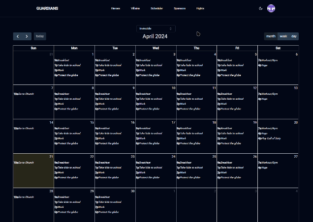
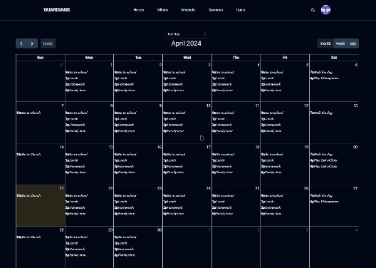
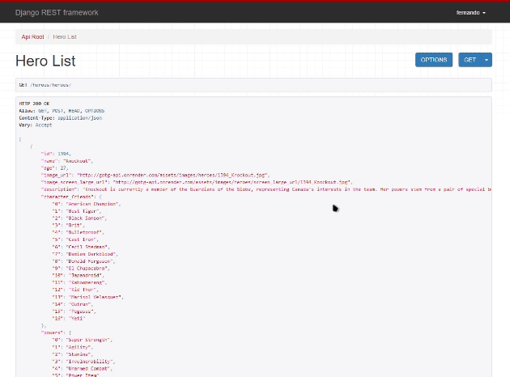

# Guardians of the Globe

This is a fullstack web-application that allow you to manage your favorite heroes of the Guardians of the Globe crew.
The application consist in two submodules, one for the front-end which uses ReactJs with NextJS and an API written in Django with the REST Framework.

### Built with

  

  

 #### Other libraries
 
   [Shadcn](https://ui.shadcn.com/)

 [NextAuth.js](https://next-auth.js.org/)

 [Zod](https://zod.dev/)

 [django Rest framework](https://www.django-rest-framework.org/)
  

## How to start
The project is deployed on [vercel.com](https://vercel.com/), while the API is being deployed on [render.com](https://render.com/).

https://guardians-front.vercel.app/

https://gotg-api.onrender.com/

Once you are on the web page, you have two options for authentication: Google and Credentials\
\
Credentials you would have to create an account and verify your email.\
\
Note: When using the Google provider, you might experience a timeout the first time. This is because the project is deployed with a free tier and only has 0.1 CPU reserved. You can try again reloading the page, and it will work.

## App composition
* Authentication
* Heroes 
* Villains
* Sponsors
* Scheduler
* Fights

### What can we wait for?

### Authentication
The authentication uses the next-auth library. By using the next-auth library we setted up a middleware that allow us to protect all the pages from our application without the need of render anything until the user is logged in.

### Heroes
The first entry page is the hero page. We feature a header that contains all the sections of our website. Additionally, we provide a theme button for adjusting the appearance, and a profile section for users to log out if needed.

In the hero page we can find with the list of all of our heroes. We can see a brief description and also have different filters to order the list: name, age. 

We can click in a hero card and be able to see all of the information of a hero in particular. For instance a hero can have: multiple personal relationships, superpowers and be funded by different sponsors.

<!-- .gif) -->

We can create a hero by clicking on the first card. To create a hero we need to give all of our hero details and once we are done, we can see our hero in our list right beside all of the rest of the crew. Give it a try! create your favorite hero.

After creating a hero, you can view all the personal information associated with that specific hero you've selected.

### 📆 Scheduler
The scheduler allow you to schedule the activities of every hero. You can choose any hero you want and assign the activities they need to do. You can add an activity for an entire day or with hours in specific.

By default you will see that some of our heroes are teenagers and they have different responsabilities than adult heroes.

For example, Invincible is an adult, while Kid Thor is not, so you can see how their schedules differ. Finally, you can delete any events you choose by clicking on them.

(once you create an event for the hero is directly we can see it on our API)

### 💀 Villains
Villains in general have similar functionalities than our heroes. We can list to see them, create one, and eliminate as well. The main difference would be their characteristics/information (not to mention, they're more badass).

### 💰 Sponsors
On the sponsors tab we can see the list of all of the sponsors. These are the sponsors that work with different heroes. Check out the tab to see some CSS that was handcrafted as practice.\

When creating your hero, remember that you can choose which sponsors will represent them. Choose wisely!

### 💥 Fights
You can list the fights the heroes have had. Each fight has an id, a hero and the villain he/she fought against. You can delete the fight if you want too.

...in progress.

### 🔗 API Endpoints
All the information, including the creation and deletion of heroes and villains, as well as their fights, sponsors, and schedules, is persisted in the database and can be accessed through the following endpoints:\
\
https://gotg-api.onrender.com/heroes/\
https://gotg-api.onrender.com/heroes/[id]/\
https://gotg-api.onrender.com/heroes/schedules/\
http://gotg-api.onrender.com/heroes/fights/\
https://gotg-api.onrender.com/heroes/sponsors/\
https://gotg-api.onrender.com/villains/\
https://gotg-api.onrender.com/villains/[id]/\

For instance, the list of heroes:

## 💯 Credits

|                  |
|:----------------:|
|  |
|     [Comic Vine](https://comicvine.gamespot.com/)    |

## ❤️ Contributor 
Fernando Acuña García\
📧 acunafer.02@gmail.com

